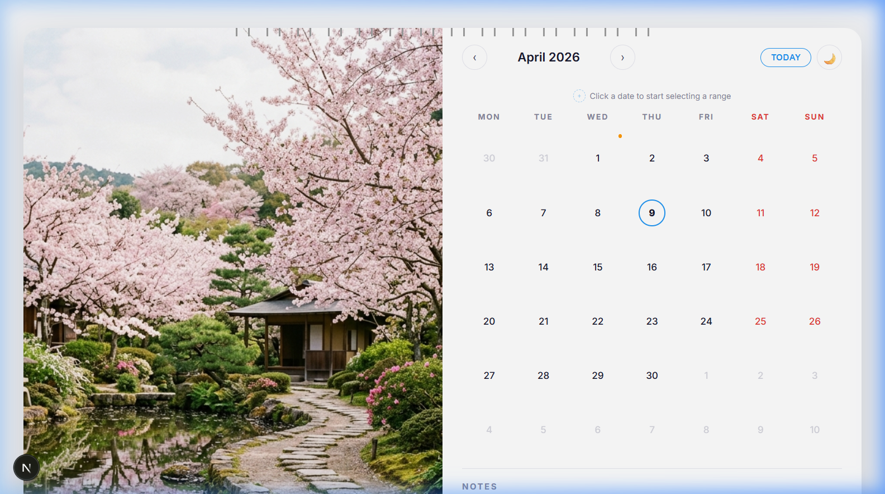

# 📅 Interactive Wall Calendar Component

A premium, interactive wall calendar component built with **Next.js 16**, **TypeScript**, and **Framer Motion**. Inspired by a physical wall calendar aesthetic, this component features beautiful seasonal hero images, date range selection, integrated notes, and a stunning dark mode.



---

## ✨ Features

### Core
- **🖼 Wall Calendar Aesthetic** — High-quality seasonal hero images with geometric accent overlays, spiral binding decoration, and elegant typography
- **📆 Day Range Selector** — Click-to-select start and end dates with smooth visual states for selected, in-range, and hover preview
- **📝 Integrated Notes** — Lined notepad-style textarea with auto-save to localStorage, supporting both monthly and range-specific notes
- **📱 Fully Responsive** — Desktop side-by-side layout, tablet/mobile stacked layout with touch-friendly targets

### Creative Extras
- **🌗 Dark Mode** — Full light/dark theme toggle with smooth transitions
- **🎨 Seasonal Themes** — Each month automatically applies a unique accent color palette (icy blue for January, cherry pink for April, harvest orange for September, etc.)
- **🎯 Holiday Markers** — US holidays displayed with orange indicator dots and tooltips on hover
- **📅 Mini Calendars** — Previous and next month mini-calendar previews below the main grid
- **⚡ Smooth Animations** — Framer Motion-powered page transitions, date selection animations, and micro-interactions
- **⌨️ Keyboard Navigation** — Arrow keys for month navigation, Escape to clear selection
- **📌 Today Indicator** — Bold text + blue dot marks the current date

---

## 🛠 Tech Stack

| Technology | Purpose |
|---|---|
| **Next.js 16** | React framework with App Router |
| **TypeScript** | Type safety |
| **Framer Motion** | Animations & transitions |
| **Vanilla CSS** | Custom design system with CSS custom properties |
| **localStorage** | Client-side persistence for notes |

---

## 🚀 Getting Started

### Prerequisites
- Node.js 18+ 
- npm

### Installation

```bash
# Clone the repository
git clone <repo-url>
cd app-root

# Install dependencies
npm install

# Start the development server
npm run dev
```

Open [http://localhost:3000](http://localhost:3000) to view the calendar.

### Build for Production

```bash
npm run build
npm start
```

---

## 📁 Project Structure

```
app-root/
├── app/
│   ├── components/
│   │   └── WallCalendar.tsx    # Main calendar component (client)
│   ├── lib/
│   │   └── calendarUtils.ts    # Date utilities, holidays, themes
│   ├── globals.css             # Design system & all styles
│   ├── layout.tsx              # Root layout with SEO metadata
│   └── page.tsx                # Home page
├── public/
│   └── images/                 # 12 seasonal hero images
│       ├── january.png
│       ├── february.png
│       ├── ...
│       └── december.png
└── package.json
```

---

## 🎨 Design Decisions

1. **Single Component File**: All sub-components (HeroPanel, DayCell, NotesSection, MiniCalendar) are co-located in `WallCalendar.tsx` for cohesion and easy code review, while maintaining clean separation of concerns through function boundaries.

2. **CSS Custom Properties**: Used a token-based design system with CSS variables for theming (light/dark mode & seasonal colors), enabling smooth transitions and maintainability without CSS-in-JS overhead.

3. **Framer Motion**: Chosen for its declarative animation API — `AnimatePresence` handles month transitions, while `motion.div` with `whileTap` provides responsive micro-interactions on day cells.

4. **No Backend Required**: Notes persist in `localStorage` keyed by month or date range. No APIs, no database — purely frontend.

5. **Responsive Strategy**: CSS Grid with `grid-template-columns: 1fr 1fr` for desktop, collapsing to `1fr` on tablet/mobile via media queries. Day cells use `aspect-ratio: 1` for consistent proportions.

---

## 🔑 Usage Guide

| Action | How |
|---|---|
| Navigate months | Click `‹` / `›` buttons or use **←** / **→** arrow keys |
| Jump to today | Click the **TODAY** button |
| Select date range | Click a start date → click an end date |
| Preview range | After selecting start, hover over dates to preview |
| Clear selection | Click **✕ Clear** or press **Escape** |
| Add notes | Type in the notes textarea (auto-saves after 500ms) |
| Toggle theme | Click the 🌙 / ☀️ button |
| View holidays | Hover over dates with orange dots |

---

## 📄 License

MIT
